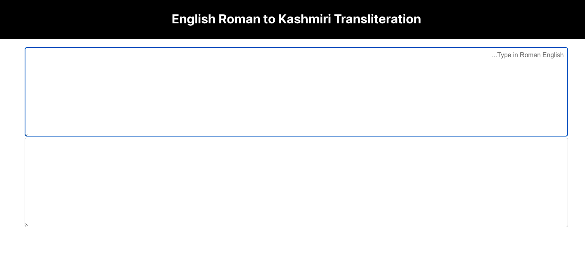

# Roman-Kashmiri Transliteration Web UI

This React web user interface (UI) facilitates the transliteration of English Roman text into Kashmiri Arabic script. The primary goal of this project is to develop a tool for English to Kashmiri transliteration and vice versa. The web UI serves as a convenient interface for testing and fine-tuning our transliteration model.

## Features

- **English to Kashmiri Transliteration:** Convert Roman English text into Kashmiri Arabic script.
- **Vice Versa:** Explore the transliteration in both directions, supporting bidirectional conversion.
- **AI4Bharat Transliteration Model:** Powered by the AI4Bharat transliteration model, ensuring accurate and reliable results.

## Usage

1. Input your Roman English text into the provided text area.
2. Click the "Transliterate" button to convert the text into Kashmiri Arabic script.
3. Explore bidirectional transliteration for a comprehensive testing experience.

## UI Screenshot

## Dependencies

- React: [Link to React](https://reactjs.org/)
- AI4Bharat Transliteration Model: [Link to AI4Bharat](https://github.com/AI4Bharat/indicTrans)

## Getting Started

1. Clone the repository: `git clone https://github.com/your/repo.git`
2. Install dependencies: `npm install`
3. Run the development server: `npm start`

## Contribution

We welcome contributions and bug reporting. Feel free to open issues or submit pull requests.

## License

This project is licensed under the [MIT License](LICENSE).

---

**Note:** Ensure you have the necessary permissions to use and modify the AI4Bharat transliteration model as per its license terms.
